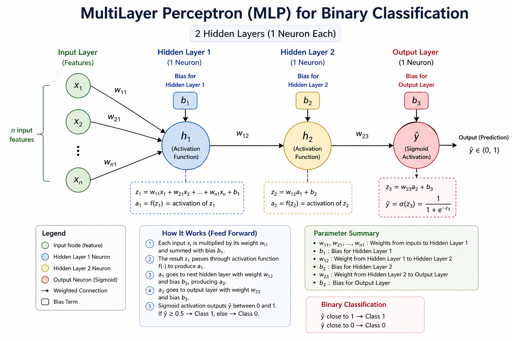

# Backpropagation – Intuition with Chain Rule

## Setup

* ŷ → predicted output
* L → loss (error)
* o₁ → output of hidden layer 1
* o₂ → output of hidden layer 2

We want to update:

* all weights
* all biases

---

## Step 1: Output Layer Update (Direct Impact)

For weights that directly affect ŷ:

* w₂₃ and b₃

Update rule:

w₂₃ = w₂₃ − η (dL/dw₂₃)
b₃ = b₃ − η (dL/db₃)

This is straightforward because:

> w₂₃ directly impacts ŷ → directly impacts loss

---

## Step 2: Hidden Layer Weights (Indirect Impact)

Now consider:

w₁₂ (between hidden layer 1 → hidden layer 2)

This does NOT directly affect loss.

So we use:

> **Chain Rule**

---

## Chain Rule Idea

We break the dependency step by step:

L depends on o₂
o₂ depends on w₁₂

So:

dL/dw₁₂ = (dL/do₂) * (do₂/dw₁₂)

---

## Going One Layer Back

Now consider:

w₁₁ (from input → hidden layer 1)

This is even further away from loss.

So:

dL/dw₁₁ = (dL/do₂) * (do₂/do₁) * (do₁/dw₁₁)

---

## Key Insight

> We pass the error backward layer by layer
> and compute how each weight contributed to that error

---

## Breaking the Middle Term (Important)

You mentioned:

> do₂/do₁ involves z (weighted sum)

Correct. Let’s write it cleanly.

Let:

z₂ = weighted sum at hidden layer 2
o₂ = activation(z₂)

Then:

do₂/do₁ = (do₂/dz₂) * (dz₂/do₁)

Where:

* do₂/dz₂ → derivative of activation function
* dz₂/do₁ → comes from weighted sum

---

## General Pattern

For any weight:

dL/dw =
(dL/doutput) ×
(product of derivatives through each layer)

---

## Bias Update (Same Logic)

Bias also follows chain rule:

b_new = b_old − η (dL/db)

---

## Full Understanding

* Output layer → direct gradient
* Hidden layers → chain rule
* Error flows backward
* Each weight updated based on its contribution

---

## One Line Summary

Backpropagation works by breaking the effect of each weight on loss into small steps using the chain rule and updating weights layer by layer from output to input.

---

