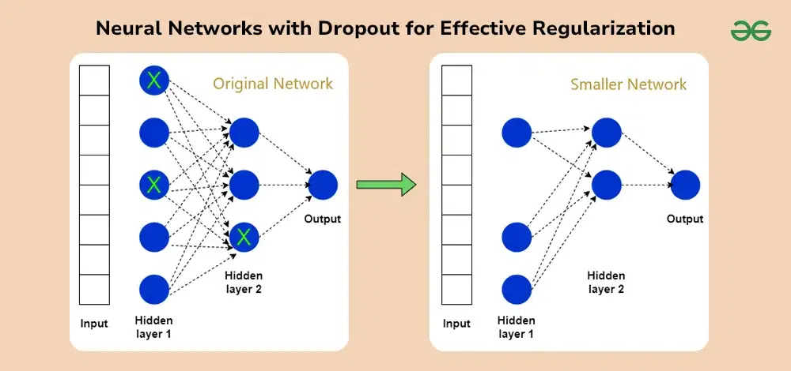

# Overfitting in Deep Learning

##  What is Overfitting?

Overfitting happens when:

> Your model learns the **training data too well**, including noise and small details, but fails on new (unseen) data.

---

##  Simple Intuition

* Model becomes a **memorizer**, not a generalizer
* It performs:

  * ✅ Very well on training data
  * ❌ Poorly on test/validation data

---

##  Example

Imagine preparing for an exam:

* Overfitting = memorizing exact answers
* Generalization = understanding concepts

👉 If questions change slightly, memorization fails

---

##  What Causes Overfitting?

### 1. Model too complex

* Too many layers / parameters
* Can memorize patterns easily

### 2. Small dataset

* Not enough variety
* Model learns noise as truth

### 3. Too many training epochs

* Model keeps fitting deeper into noise

### 4. No regularization

* Nothing prevents over-learning

---

##  Signs of Overfitting

* Training loss ↓ continuously
* Validation loss ↓ then ↑

👉 That gap = overfitting

---

##  What Problems It Causes

* Poor real-world performance
* Unstable predictions
* Model becomes unreliable

👉 In short: **looks smart, but isn’t useful**

---

#  How Dropout Helps

##  What is Dropout?

Dropout randomly turns off (drops) neurons during training.

Example:

* Dropout rate = 0.5
  👉 50% neurons are randomly ignored each step

---

##  How it Works (Intuition)

Instead of one fixed network:

👉 You train **many smaller networks** (random subsets)

---

##  Why this reduces overfitting

### 1. Prevents memorization

* Neurons can’t rely on specific other neurons
* Forces learning **robust features**

---

### 2. Reduces co-adaptation

* Neurons stop “teaming up” in a fragile way

---

### 3. Acts like ensemble learning

* Many subnetworks → better generalization

---

##  During Testing

* No neurons are dropped
* Outputs are scaled appropriately

👉 So full network is used

---

##  Important Reality Check

Dropout is helpful, but not magic.

You still need:

* More data (best solution)
* Proper model size
* Early stopping
* Regularization (L2)

---
