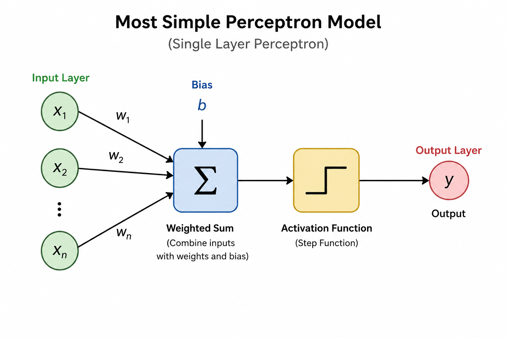

# Single Layer Perceptron – Notes

## Arrangement

* We start with **inputs**, where each input represents a feature

* Each feature is associated with a **weight**, initialized with some values

  * Each weight represents the influence of its respective feature

* We also have a **bias**

  * Bias provides flexibility in the decision boundary
  * It helps the model shift its decision instead of being fixed

* Then we have an **activation function**, specifically the **Step Function**

* Finally, we get the **output**

---

## Step Function (Activation Function)

The step function takes the computed value and converts it into a final decision.

Basic idea:

* If the value is greater than a threshold → output = 1
* If the value is less than the threshold → output = 0

So it acts like a **decision maker**:

* Yes / No
* 1 / 0

It turns a continuous value into a discrete output.

---

## Process

### Step 1: Weighted Sum

We consider all features and weights:

* Compute: weighted sum 
```
(w1x1 + w2x2 + .. + WnXn) + bias
```

This combines:

* input values
* their importance (weights)
* and bias

---

### Step 2: Apply Step Function

* The weighted sum is passed through the step function
* This generates the output (0 or 1)

---

### Step 3: Calculate Error

* Compare predicted output with actual output
* Find the difference (error)

---

### Step 4: Update Weights

Your idea is correct, just refine it slightly:

* If prediction is too high → decrease weights
* If prediction is too low → increase weights

More clearly:

> The model adjusts weights in a direction that reduces error

Bias is also updated along with weights.

---

### Step 5: Repeat

* This process continues
* Until the model produces outputs close to actual values

---

## Final Flow

Input → Weighted Sum (wx + b) → Step Function → Output →
Compare with Actual → Error → Update Weights & Bias → Repeat

---

## Key Insight

* Weights control importance of features
* Bias shifts the decision boundary
* Step function makes the final decision
* Learning happens by adjusting weights and bias based on error

---

You’re on the right track. I’ll keep your idea, just tighten the wording so it’s precise and easy to build on.

---

## Limitation of Single Layer Perceptron

### Core Idea

A simple perceptron works well when the relationship between inputs and output is **linear**.

* It can separate data using a **single decision boundary**
* Works for simple classification problems

---

### Where it Fails

When the data has:

* **Hidden non-linearity**
* **Complex relationships between features**
* **Hierarchical patterns (features built over features)**

the single layer perceptron cannot capture these patterns.

---

### Why it Fails (Important Insight)

The perceptron:

* Performs only **one transformation step**
* Makes a decision in **one shot**

So it tries:

Input → Output (direct mapping)

This is too limited when:

* the pattern requires multiple steps of transformation

---

### Example Insight (Conceptual)

Some patterns cannot be separated by a single straight boundary.

They require:

* multiple transformations
* intermediate representations

A single perceptron has no mechanism to:

* build intermediate features
* refine representations step by step

---

### What is Needed

To handle such data, we need:

> **Multi Layer Perceptron (MLP)**

---

### What MLP Adds

* Multiple layers (hidden layers)
* Step-by-step transformation of data
* Ability to learn hierarchical representations

So instead of:

Input → Output

We get:

Input → Hidden Layer(s) → Output

---

## Final Understanding

* Single Layer Perceptron → works for linear patterns
* Multi Layer Perceptron → works for complex, non-linear, hierarchical patterns

---

## One Line Summary

A single perceptron makes one decision step, while a multi-layer perceptron builds understanding step by step.

