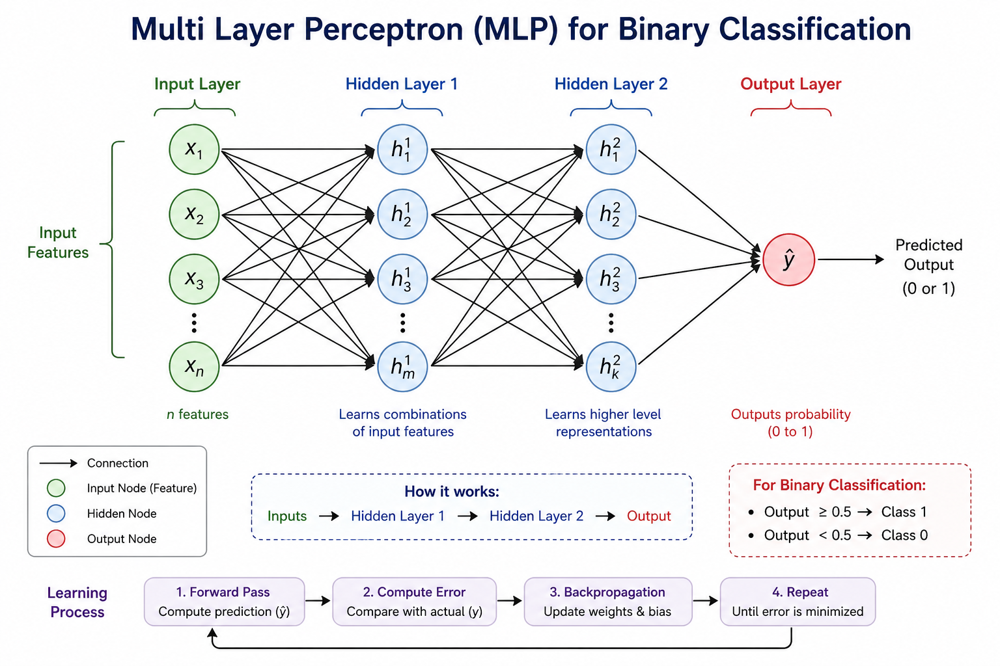

# Multi Layer Perceptron (MLP) – Binary Classification

## Goal

The main goal of this model is:

* Learn patterns from **complex data**
* Perform **binary classification** (output: 0 or 1)

---

## Setup

### 1. Input Features

* These represent the data
* Example: x₁, x₂, x₃, ...

---

### 2. Weights

* Each input is associated with weights
* Initially, weights are **randomly assigned**
* They control the importance of features

---

### 3. Hidden Layers

* There are **multiple hidden layers**
* Each layer contains multiple units
* Each unit has:

  * its own weights
  * its own bias
  * its own activation function

These layers are responsible for:

* transforming data step by step
* building new representations

---

### 4. Output Layer

* Final layer that produces prediction
* For binary classification:

  * commonly uses **Sigmoid activation function**
* Output is:

  * close to 1 → class 1
  * close to 0 → class 0

---

## Process (Feed Forward)

This entire process is called:

> **Feed Forward Neural Network**

---

### Step 1: First Hidden Layer

For each unit:

#### Weighted Sum:

z = w₁x₁ + w₂x₂ + w₃x₃ + ... + b

#### Activation:

a = activation(z)

So:

* weighted sum + bias → passed through activation function
* produces a new transformed value

---

### Step 2: Form New Representation

* Each unit produces one value
* All values together form a **new representation of features**

This becomes input for the next hidden layer.

---

### Step 3: Repeat for Next Layers

For each layer:

* Take input from previous layer
* Compute weighted sum + bias
* Apply activation function
* Generate new representation

This continues layer by layer.

---

### Step 4: Output Layer

Final step:

#### Weighted Sum:

z = w₁a₁ + w₂a₂ + ... + b

#### Sigmoid Activation:

output = σ(z)

* Converts value into range (0, 1)
* Final prediction:

  * ≥ 0.5 → class 1
  * < 0.5 → class 0

---

## Key Understanding

* Each layer transforms the data
* Each transformation makes patterns clearer
* Final layer makes the decision

---

## One Line Summary

A multi-layer perceptron works by repeatedly transforming input through multiple layers using weighted sums and activation functions to finally predict 0 or 1.

---

## Part 2 (Next Page)

* Error calculation
* Backpropagation
* How weights actually get updated

These will make the full learning process complete.
