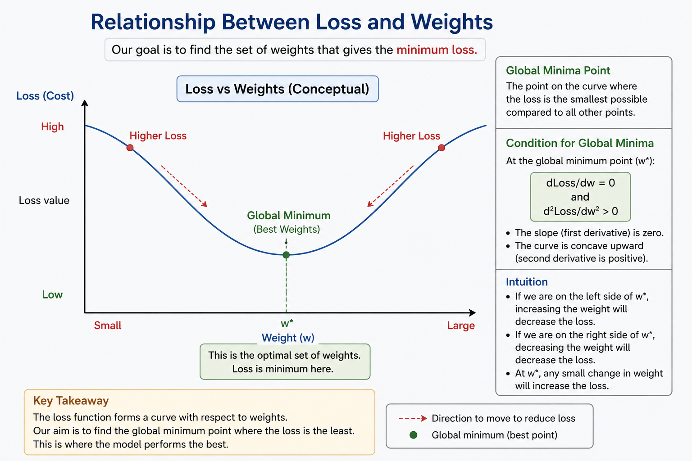

# Weight Update Intuition (Gradient-Based Learning)

## Setup

* Let **L** be the loss (error)
* Let **w** be the weight we want to update

---

## Goal

> Find the value of **w** where loss is minimum (global minimum)

---

## Why Derivative?

Think of a graph:

* x-axis → weight (w)
* y-axis → loss (L)

This typically looks like a **bowl-shaped curve** (minimum in the middle).

* The **derivative dL/dw** tells:

  > how loss is changing with respect to weight

* It represents the **slope at that point**

---

## Understanding the Slope

At any point:

* If slope (dL/dw) is **positive**
  → loss increases as w increases
  → so we should **decrease w**

* If slope (dL/dw) is **negative**
  → loss decreases as w increases
  → so we should **increase w**

So:

> The slope tells the direction to move to reduce loss

---

## Problem Without Control

If we directly update:

* We might take a **very large step**
* This can:

  * overshoot the minimum
  * cause instability

---

## Learning Rate (Control)

To control the step size, we introduce:

> **Learning Rate (η)**

* It controls how big or small the update is
* Small value → slow but stable
* Large value → fast but risky

This is called:

> **Control over convergence**

---

## Final Weight Update Rule

w_new = w_old − η * (dL/dw_old)

---

## Key Understanding

* dL/dw → gives direction
* learning rate (η) → controls step size
* together → guide the model toward minimum loss

---

## One Line Summary

We use the derivative to know which direction to move and the learning rate to control how far to move, so that weights reach the point of minimum loss.

---

Good catch—that’s an important detail, and you don’t want to miss it.

Let’s integrate it cleanly into your notes.

---

## Updating Weights Bias

### What we had earlier

We update weights using:

w_new = w_old − η * (dL/dw)

---

### Bias also needs to be updated

Bias is just like a weight, but it is **not tied to any input**.

So it also affects the output and contributes to the error.

👉 That means:

> Bias must also be updated to reduce loss

---

### Bias Update Rule

b_new = b_old − η * (dL/db)

---

### Why bias update matters

* Weights control **influence of features**
* Bias controls **shift of decision boundary**

If you don’t update bias:

* model becomes restricted
* may not reach optimal solution

---

### Updated Full Understanding

For every layer:

* update all **weights**
* update all **biases**

So learning becomes:

> Adjust weights + adjust bias → reduce loss

---

### Final Combined View

* w_new = w_old − η * (dL/dw)
* b_new = b_old − η * (dL/db)

---

## One Line Summary

Both weights and bias are parameters of the model, and both must be updated using gradients to properly minimize the loss.

---

